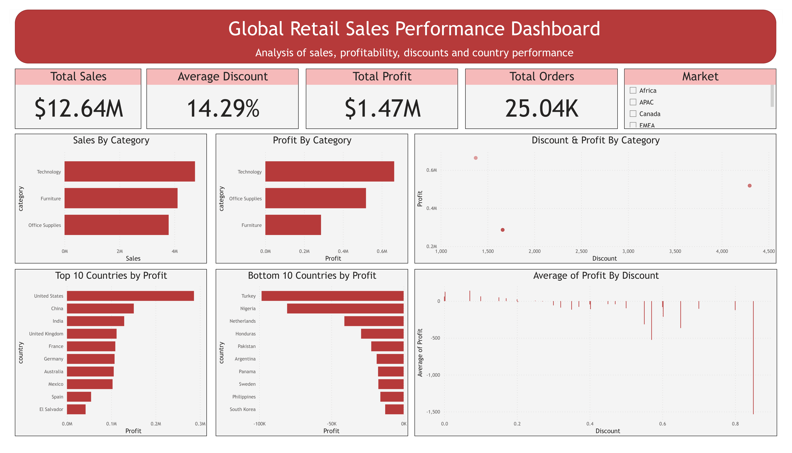

# Retail Sales Analytics

## Objective

Analyze global retail sales performance and identify the factors affecting profitability across products, categories, and countries.

## Tools Used

- Python
- Pandas
- Matplotlib
- Power BI
- Git
- GitHub

## Dataset

Global Superstore sales dataset containing:

- 51,290 orders
- Multiple product categories
- Global sales records
- Revenue, profit, discount, and shipping information

## Key Findings

### Category Performance

- Technology generated the highest sales and profit.
- Furniture generated strong sales but the lowest profit margin (~7%).

### Discount Impact

- Discounts showed a negative correlation with profit.
- Country-level analysis showed a very strong negative relationship between discount rates and profit margins.

### Subcategory Analysis

- Tables was the worst-performing subcategory.
- Average discount for Tables was approximately 29%.
- Higher discounts were strongly associated with losses.

### Geographic Insights

Most profitable countries:

- United States
- China
- India
- United Kingdom
- France

Least profitable countries:

- Turkey
- Nigeria
- Netherlands
- Honduras
- Pakistan

## Dashboard



The dashboard highlights:

- Total Sales
- Total Profit
- Average Discount
- Category Performance
- Country Profitability
- Discount vs Profit Relationship

## Recommendations

1. Review discount policies for Furniture and Tables.
2. Investigate pricing strategy in Turkey and Nigeria.
3. Expand high-margin Technology products.
4. Monitor discount thresholds to prevent profit erosion.

## Project Structure

```text
Retail-Sales-Analytics/
│
├── dashboard/
│   └── retail_sales_dashboard.pbix
│
├── data/
│   ├── raw/
│   └── processed/
│
├── images/
│   └── retail_sales_dashboard.png
│
├── notebooks/
│   └── retail_sales_analysis.ipynb
│
├── sql/
│
└── README.md
```